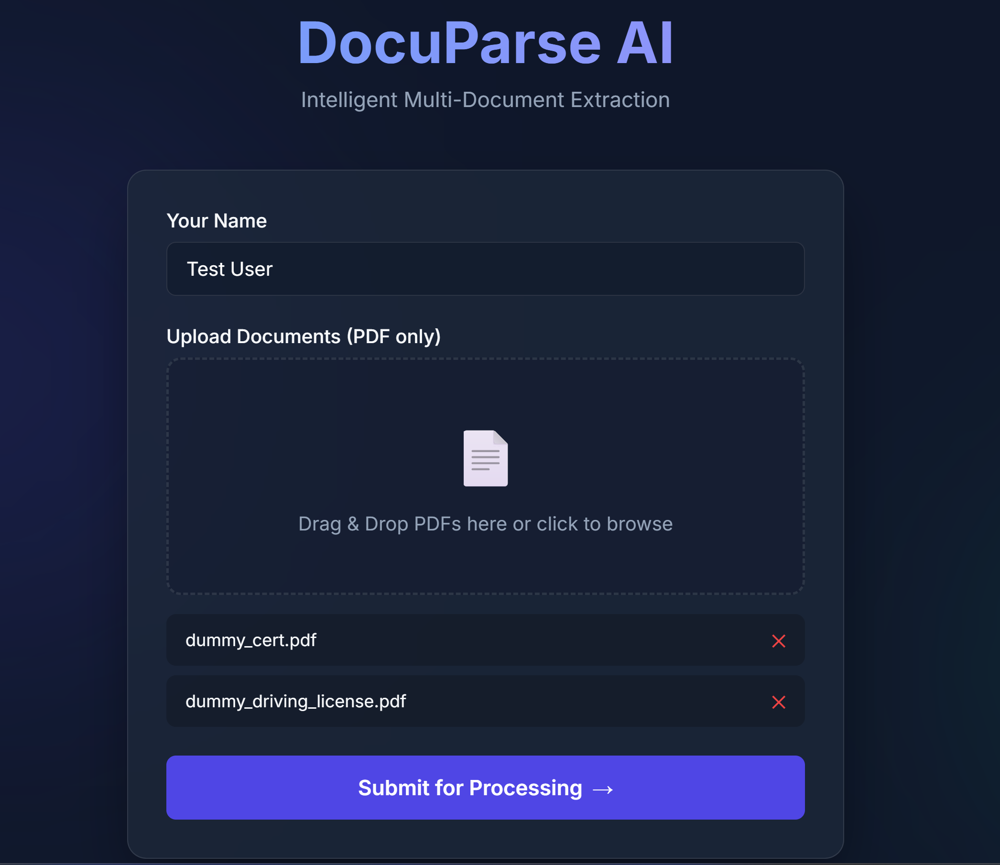
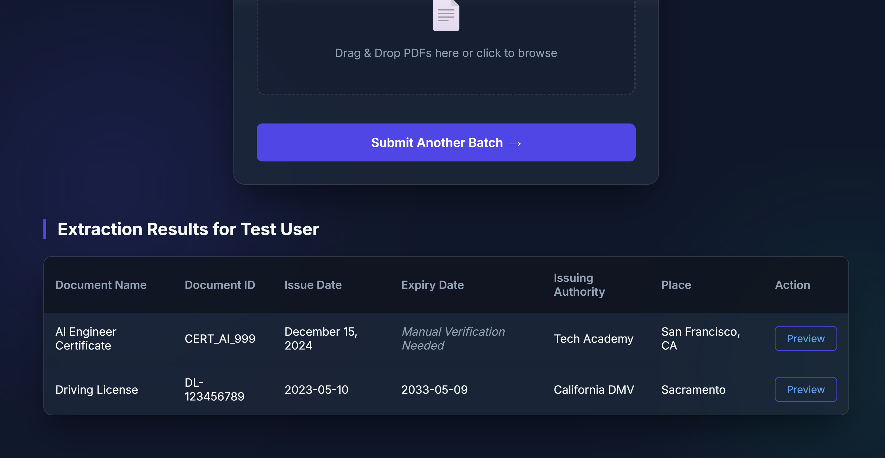

# 📄 DocuParse AI

> An intelligent, open-source document parsing web application powered by FastAPI and Google Gemini AI.

[](https://www.python.org/)
[](https://fastapi.tiangolo.com/)
[](https://ai.google.dev/)
[](https://opensource.org/licenses/MIT)

DocuParse AI is a premium, lightweight web application designed to effortlessly extract structured data from diverse PDF documents. Whether it is a driving license, an academic certificate, or an invoice, the application leverages the **Google Gemini 2.5 AI** to deeply understand the document's layout and instantly extract exactly what you need.

## ✨ Features

- **Intelligent Extraction:** Handles completely different document layouts and structures natively without predefined rules or brittle OCR coordinates.
- **Batch Processing UI:** Drag and drop multiple PDFs at once. The system queues and processes them one-by-one with a live progress indicator.
- **Dynamic AI Parsing:** Unconstrained structured outputs! The system autonomously determines the document classification and extracts highly relevant, document-specific fields on the fly rather than relying on a rigid schema.
- **Card Accordion UI:** A responsive, toggleable grid layout built to elegantly display completely varying document structures simultaneously without cluttering the screen.
- **CSV Reporting:** One-click bulk export that intelligently maps all newly discovered AI fields across the batch into a perfectly merged spreadsheet.
- **Smart Fallbacks:** Identifies when essential data is completely missing and clearly flags it for *Manual Verification*.
- **Premium UI/UX:** Built with a modern, glassmorphism aesthetic using responsive Vanilla CSS and JS.
- **Document Previews:** Hosted local previews for rapid manual verification of uploaded PDFs.

## 🛠️ Tech Stack

- **Backend:** Python, FastAPI, Uvicorn, python-multipart
- **AI Integration:** Google GenAI SDK (`gemini-2.5-flash`) with Structured JSON Outputs
- **Frontend:** HTML5, Modern Vanilla CSS (Glassmorphism), Vanilla JavaScript

## 🚀 Getting Started

### Prerequisites

- Python 3.9 or higher
- A [Google Gemini API Key](https://aistudio.google.com/)

### Installation

1. **Clone the repository:**
   ```bash
   git clone https://github.com/pradipchavda29/docuparse-ai.git
   cd docuparse-ai
   ```

2. **Install dependencies:**
   It is recommended to use a virtual environment.
   ```bash
   python -m venv venv
   source venv/bin/activate  # On Windows: venv\Scripts\activate
   pip install -r requirements.txt
   ```

3. **Set up Environment Variables:**
   Copy the example environment file and insert your API key.
   ```bash
   cp .env.example .env
   ```
   Open `.env` and add:
   ```ini
   GEMINI_API_KEY=your_actual_api_key_here
   ```

4. **Run the Application:**
   Start the FastAPI development server.
   ```bash
   python -m uvicorn main:app --port 8000 --host 127.0.0.1
   ```

5. **Access the Web Interface:**
   Open your browser and navigate to [http://127.0.0.1:8000](http://127.0.0.1:8000).

## 📸 Screenshots

**1. Upload Interface**


**2. Extraction Results**


## 🤝 Contributing

Contributions are what make the open source community such an amazing place to learn, inspire, and create. Any contributions you make are **greatly appreciated**.

1. Fork the Project
2. Create your Feature Branch (`git checkout -b feature/AmazingFeature`)
3. Commit your Changes (`git commit -m 'Add some AmazingFeature'`)
4. Push to the Branch (`git push origin feature/AmazingFeature`)
5. Open a Pull Request

## 📝 License

Distributed under the MIT License. See `LICENSE` for more information.
